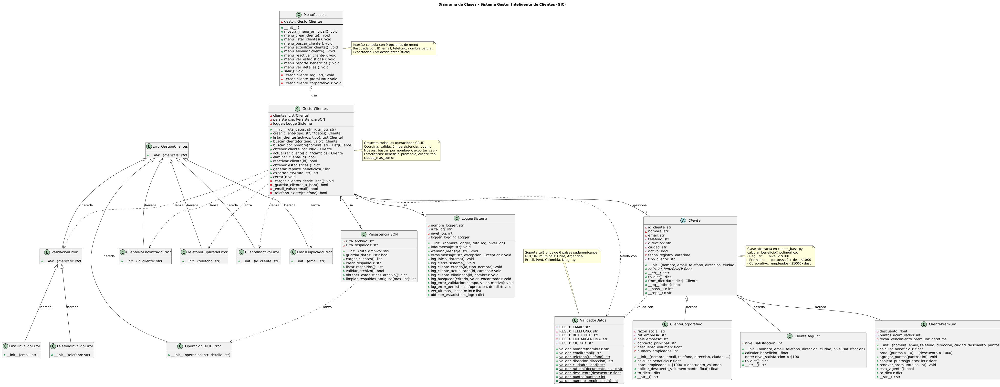

# 🧠 GIC — Gestor Inteligente de Clientes

Sistema de gestión de clientes desarrollado en Python con arquitectura modular
y los 4 pilares de la Programación Orientada a Objetos (POO).


---

## 📋 Descripción

GIC permite gestionar 3 tipos de clientes (Regular, Premium y Corporativo)
con soporte multi-país, persistencia JSON, logging de auditoría y menú
interactivo en consola. Implementa herencia, polimorfismo, encapsulación
y abstracción de forma integral.

---

## ✨ Funcionalidades

- ✅ CRUD completo (crear, listar, buscar, actualizar, eliminar, reactivar)
- ✅ Búsqueda por ID, email, teléfono y nombre parcial
- ✅ Validaciones multi-país (Chile, Argentina, Brasil, Perú, Colombia, Uruguay)
- ✅ Cálculo de beneficios polimórfico por tipo de cliente
- ✅ Estadísticas: total, por tipo, beneficio promedio, cliente top, ciudad más común
- ✅ Exportación a CSV
- ✅ Persistencia JSON con respaldos automáticos
- ✅ Logging de auditoría (INFO / WARNING / ERROR)
- ✅ Manejo de excepciones personalizadas

---

## 🏗️ Arquitectura

```
gic-python/
│
├── main.py                        # Punto de entrada
│
├── modelos/                       # Capa de datos
│   ├── __init__.py
│   ├── cliente_base.py            # Clase abstracta Cliente
│   ├── cliente_regular.py         # ClienteRegular
│   ├── cliente_premium.py         # ClientePremium
│   ├── cliente_corporativo.py     # ClienteCorporativo
│   └── excepciones.py             # Excepciones personalizadas
│
├── gestor/                        # Capa de lógica
│   ├── gestor_clientes.py         # CRUD + estadísticas + exportación
│   └── logger.py                  # Sistema de logging
│
├── utils/                         # Utilidades
│   ├── validador.py               # Validaciones multi-país con regex
│   └── persistencia.py            # Persistencia JSON + respaldos
│
├── interfaz/                      # Capa de presentación
│   └── menu_consola.py            # Menú interactivo CLI
│
├── tests/                         # Demos por módulo
│   ├── demo_clientes.py
│   ├── demo_gestor.py
│   ├── demo_logger.py
│   ├── demo_persistencia.py
│   └── demo_validador.py
│
├── data/                          # Generado en ejecución
│   ├── clientes.json
│   └── respaldos/
│
├── logs/                          # Generado en ejecución
│   └── sistema.log
│
└── docs/
    ├── DOCUMENTACION_POO.md
    ├── ESPECIFICACIONES.txt
    ├── DIAGRAMA_CLASES_GIC.puml
    └── diagrama_uml.png
```

---

## 🧬 Pilares POO

### Herencia
```
modelos/
├── cliente_base.py → Cliente (clase abstracta base)
├── cliente_regular.py → ClienteRegular (nivel_satisfaccion × $100)
├── cliente_premium.py → ClientePremium (puntos × 10 + descuento × 1000)
└── cliente_corporativo.py → ClienteCorporativo (empleados × $1000 × descuento)
```

### Polimorfismo — `calcular_beneficio()`

| Tipo | Fórmula | Ejemplo |
|------|---------|---------|
| Regular | `nivel_satisfaccion × $100` | nivel 4 → **$400** |
| Premium | `(puntos × 10) + (descuento × 1000)` | 250 pts + 15% → **$2.650** |
| Corporativo | `empleados × $1000 × descuento_volumen` | 150 emp + 20% → **$30.000** |

### Encapsulación
Todos los atributos pasan por `ValidadorDatos` antes de asignarse.
Operaciones críticas solo accesibles a través de métodos controlados.

### Abstracción
`ValidadorDatos`, `PersistenciaJSON` y `LoggerSistema` ocultan su
complejidad interna exponiendo interfaces simples.

---

## 🚀 Instalación y Uso

### Requisitos
- Python 3.14
- Sin dependencias externas (solo librería estándar)

### Clonar el repositorio
```bash
git clone https://github.com/javiersandovaltap-beep/gic-python.git
cd gic-python
```

### Ejecutar el sistema
```bash
python main.py
```

### Ejecutar demos
```bash
python tests/demo_clientes.py
python tests/demo_gestor.py
python tests/demo_logger.py
python tests/demo_persistencia.py
python tests/demo_validador.py
```

---

## 🌍 Validaciones Multi-País

| País | Teléfono | RUT/DNI |
|------|----------|---------|
| 🇨🇱 Chile | `+56 9 1234 5678` | `12.345.678-9` |
| 🇦🇷 Argentina | `+54 9 11 1234 5678` | `12.345.678` |
| 🇧🇷 Brasil | `+55 11 9 1234 5678` | `123.456.789-01` |
| 🇵🇪 Perú | `+51 9 1234 5678` | `12345678` |
| 🇨🇴 Colombia | `+57 300 1234567` | `1234567890` |
| 🇺🇾 Uruguay | `+598 9 1234 5678` | `1.234.567-8` |

---

## 📊 Diagrama de Clases



---

## 📁 Documentación

- [`docs/DOCUMENTACION_POO.md`](docs/DOCUMENTACION_POO.md) — Implementación detallada de los 4 pilares POO
- [`docs/ESPECIFICACIONES.txt`](docs/ESPECIFICACIONES.txt) — Requisitos funcionales y técnicos
- [`docs/diagrama_uml.png`](docs/diagrama_uml.png) — Diagrama de clases completo

---

## 👨‍💻 Autor

**Javier Sandoval**
[](https://github.com/javiersandovaltap-beep)

---

## 📄 Licencia

Este proyecto está bajo la licencia MIT.
